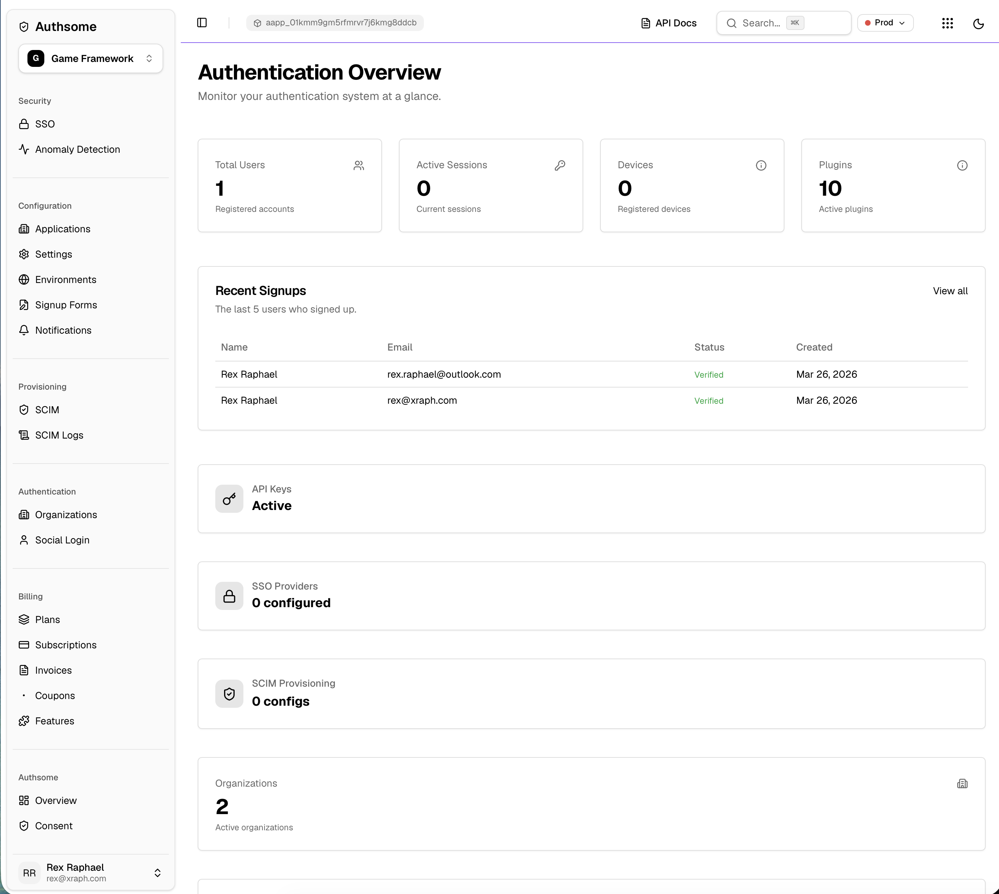

<p align="center">
  <h1 align="center">Authsome</h1>
  <p align="center">A composable, plugin-driven authentication and identity engine for Go.</p>
</p>

<p align="center">
  <a href="#features">Features</a> &middot;
  <a href="#quick-start">Quick Start</a> &middot;
  <a href="#plugins">Plugins</a> &middot;
  <a href="#sdks">SDKs</a> &middot;
  <a href="#api-overview">API</a> &middot;
  <a href="#configuration">Configuration</a>
</p>

---

Authsome is a full-featured authentication engine built for the [Forge](https://github.com/xraph/forge) ecosystem. It provides core identity management out of the box &mdash; users, sessions, organizations, RBAC, devices, API keys &mdash; and ships every authentication method as a swappable plugin so you only pay for what you use.

<p align="center">
  
</p>

## Features

### Core Identity
- **User management** &mdash; registration, profiles, email verification, password resets
- **Session management** &mdash; configurable TTLs, refresh token rotation, IP/device binding
- **Organizations & teams** &mdash; multi-tenant with memberships, invitations, and team hierarchy
- **RBAC** &mdash; roles, permissions, and role hierarchies with middleware enforcement
- **API keys** &mdash; scoped keys with expiration and automatic header/bearer detection
- **Device tracking** &mdash; register, trust, and manage user devices
- **Webhooks** &mdash; event-driven integrations for all auth lifecycle events
- **Security events** &mdash; audit trail for every authentication action

### Authentication Methods (Plugins)
- **Password** &mdash; bcrypt/argon2 with configurable policy (length, complexity, history, expiration)
- **Social OAuth2** &mdash; Google, GitHub, and 30+ providers
- **Magic Links** &mdash; passwordless email authentication
- **Passkeys / WebAuthn** &mdash; FIDO2 hardware and platform authenticators
- **MFA** &mdash; TOTP and SMS-based second factors
- **API Keys** &mdash; machine-to-machine authentication
- **SSO / SAML** &mdash; enterprise single sign-on

### Security & Governance
- Account lockout with configurable thresholds
- Per-endpoint rate limiting
- Password history enforcement and expiration
- Session binding to IP and device fingerprint
- Anomaly detection, GeoIP, impossible travel, VPN detection, IP reputation (via plugins)

### Admin Dashboard
A built-in admin dashboard provides a real-time overview of your authentication system &mdash; users, sessions, devices, plugins, recent signups, SSO providers, SCIM provisioning, organizations, and more.

### Multi-Database Support
| Driver     | Use Case       |
|------------|----------------|
| PostgreSQL | Production     |
| SQLite     | Development    |
| MongoDB    | Alternative    |
| Memory     | Testing        |

## Quick Start

### Install

```bash
go get github.com/xraph/authsome
```

### Standalone Server

```go
package main

import (
    "context"
    "net/http"
    "os"
    "os/signal"
    "syscall"

    "github.com/xraph/forge"
    authsome "github.com/xraph/authsome"
    "github.com/xraph/authsome/api"
    "github.com/xraph/authsome/middleware"
    "github.com/xraph/authsome/plugins/password"
    "github.com/xraph/authsome/store/memory"
)

func main() {
    store := memory.New()

    engine, err := authsome.NewEngine(
        authsome.WithStore(store),
        authsome.WithDisableMigrate(),

        // Enable authentication plugins:
        authsome.WithPlugin(password.New()),
        // authsome.WithPlugin(social.New(social.WithGitHub(clientID, secret, callbackURL))),
        // authsome.WithPlugin(magiclink.New()),
        // authsome.WithPlugin(mfa.New()),
    )
    if err != nil {
        panic(err)
    }

    if err := engine.Start(context.Background()); err != nil {
        panic(err)
    }

    a := api.New(engine)
    router := forge.NewRouter()
    router.Use(middleware.AuthMiddleware(engine.ResolveSessionByToken, engine.ResolveUser, nil))
    a.RegisterRoutes(router)

    srv := &http.Server{Addr: ":8080", Handler: router.Handler()}

    go func() {
        sigCh := make(chan os.Signal, 1)
        signal.Notify(sigCh, syscall.SIGINT, syscall.SIGTERM)
        <-sigCh
        engine.Stop(context.Background())
        srv.Close()
    }()

    srv.ListenAndServe()
}
```

```bash
# Sign up
curl -X POST http://localhost:8080/v1/auth/signup \
  -H 'Content-Type: application/json' \
  -d '{"email":"user@example.com","password":"SecureP@ss1","name":"Alice"}'

# Sign in
curl -X POST http://localhost:8080/v1/auth/signin \
  -H 'Content-Type: application/json' \
  -d '{"email":"user@example.com","password":"SecureP@ss1"}'

# Get current user
curl http://localhost:8080/v1/auth/me \
  -H 'Authorization: Bearer <session_token>'

# OpenAPI spec
curl http://localhost:8080/.well-known/authsome/openapi
```

### As a Forge Extension

```go
app := forge.New(
    forge.WithExtension(authsome.New(
        authsome.WithPlugin(password.New()),
        authsome.WithPlugin(social.New(
            social.WithGoogle(clientID, secret, callbackURL),
        )),
    )),
)
```

## Plugins

Authsome ships with **24 plugins** organized by category:

| Category | Plugins |
|----------|---------|
| **Authentication** | `password`, `social`, `magiclink`, `passkey`, `mfa`, `apikey`, `sso`, `phone` |
| **Identity** | `organization`, `consent`, `subscription`, `waitlist` |
| **Communication** | `email`, `notification` |
| **Risk & Security** | `anomaly`, `geofence`, `geoip`, `impossibletravel`, `ipreputation`, `riskengine`, `vpndetect` |
| **Provisioning** | `scim`, `deviceverify`, `oauth2provider` |

Enable only the plugins you need:

```go
authsome.WithPlugin(password.New())
authsome.WithPlugin(social.New(social.WithGitHub(id, secret, cb)))
authsome.WithPlugin(magiclink.New())
authsome.WithPlugin(mfa.New())
authsome.WithPlugin(passkey.New(passkey.WithRPID("example.com")))
```

## SDKs

Pre-generated client SDKs are available for multiple languages:

| Language   | Package |
|------------|---------|
| Go         | `github.com/xraph/authsome/sdk/go` |
| TypeScript | `@xraph/authsome-sdk` |
| Dart       | `authsome_sdk` |

SDKs are auto-generated from the OpenAPI spec at `/.well-known/authsome/openapi`.

## API Overview

### Authentication
| Method | Endpoint | Description |
|--------|----------|-------------|
| `POST` | `/v1/signup` | Register a new user |
| `POST` | `/v1/signin` | Authenticate |
| `POST` | `/v1/signout` | End session |
| `POST` | `/v1/refresh` | Refresh session token |
| `POST` | `/v1/forgot-password` | Request password reset |
| `POST` | `/v1/reset-password` | Complete password reset |
| `POST` | `/v1/verify-email` | Verify email address |

### User & Session
| Method | Endpoint | Description |
|--------|----------|-------------|
| `GET` | `/v1/me` | Get current user |
| `PATCH` | `/v1/me` | Update profile |
| `GET` | `/v1/sessions` | List active sessions |
| `DELETE` | `/v1/sessions/:id` | Revoke a session |

### Devices
| Method | Endpoint | Description |
|--------|----------|-------------|
| `GET` | `/v1/devices` | List devices |
| `DELETE` | `/v1/devices/:id` | Remove device |
| `PATCH` | `/v1/devices/:id/trust` | Trust a device |

### Discovery
| Method | Endpoint | Description |
|--------|----------|-------------|
| `GET` | `/.well-known/authsome/manifest` | Service manifest |
| `GET` | `/.well-known/authsome/openapi` | OpenAPI 3.x spec |

Full API documentation is available via the auto-generated OpenAPI spec.

## Configuration

```go
authsome.NewEngine(
    authsome.WithConfig(authsome.Config{
        BasePath: "/auth",
        Session: authsome.SessionConfig{
            TokenTTL:          1 * time.Hour,
            RefreshTokenTTL:   30 * 24 * time.Hour,
            MaxActiveSessions: 5,
            BindToIP:          true,
            BindToDevice:      true,
        },
        Password: authsome.PasswordConfig{
            MinLength: 10,
        },
        RateLimit: authsome.RateLimitConfig{/* ... */},
        Lockout:   authsome.LockoutConfig{/* ... */},
    }),
)
```

## Architecture

```
authsome/
  engine.go          Core engine — plugin lifecycle, auth strategy
  service.go         Business logic — users, sessions, orgs, RBAC
  config.go          Configuration types
  api/               REST API handlers and route registration
  middleware/        Auth and RBAC middleware
  plugins/           24 swappable authentication plugins
  store/             Database backends (pg, sqlite, mongo, memory)
  sdk/               Auto-generated client SDKs (Go, TS, Dart)
  dashboard/         Admin dashboard UI
  ui/                React, Next.js, Vue component libraries
```

## License

Copyright (c) Xraph. All rights reserved.
