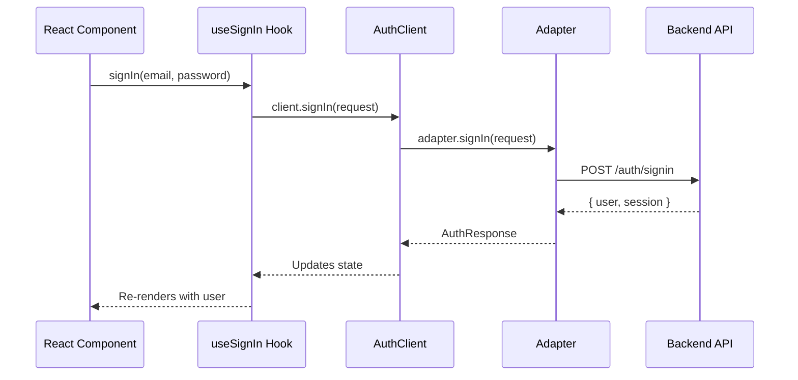

import { Callout } from 'fumadocs-ui/components/callout'
import { Card, Cards } from 'fumadocs-ui/components/card'

# Adapters

Adapters are the bridge between your UI and your authentication backend. They implement the `AuthProvider` interface from `@authsome/ui-core`, translating AuthSome UI calls into API requests for your specific backend.

## How Adapters Work



You write your UI once. When you switch backends, you only swap the adapter -- no UI changes needed.

## Choosing an Adapter

| Adapter | Backend | OAuth | Magic Link | 2FA | Passkeys | Organizations | Phone |
|---------|---------|-------|------------|-----|----------|---------------|-------|
| `@authsome/adapter-authsome` | AuthSome Go | Yes (plugin) | Yes (plugin) | Yes (plugin) | Yes (plugin) | Yes | Yes (plugin) |
| `@authsome/adapter-clerk` | Clerk | Yes | Yes | Yes | Yes | Yes | Yes |
| `@authsome/adapter-supabase` | Supabase | Yes | Yes | Yes | No | No | Yes |
| `@authsome/adapter-generic` | Any REST API | Configurable | Configurable | Configurable | Configurable | No | Configurable |

<Cards>
  <Card
    title="AuthSome Adapter"
    description="For the AuthSome Go backend. Full-featured with plugin-based capabilities."
    href="/docs/ui/adapters/authsome"
  />
  <Card
    title="Clerk Adapter"
    description="For Clerk-powered apps. Wraps the Clerk JS SDK."
    href="/docs/ui/adapters/clerk"
  />
  <Card
    title="Supabase Adapter"
    description="For Supabase Auth. Wraps @supabase/supabase-js."
    href="/docs/ui/adapters/supabase"
  />
  <Card
    title="Generic Adapter"
    description="For custom REST APIs. Configure endpoints and response transformers."
    href="/docs/ui/adapters/generic"
  />
</Cards>

## Common Adapter Pattern

All adapters follow the same lifecycle:

```typescript
import { AuthClient } from '@authsome/ui-core';

// 1. Create the adapter
const adapter = new SomeAdapter();

// 2. Initialize with configuration
await adapter.initialize({
  apiUrl: 'https://auth.yourapp.com',
  // adapter-specific options...
});

// 3. Pass to AuthClient
const client = new AuthClient({ provider: adapter });

// 4. Use in React
<AuthProvider client={client}>
  <App />
</AuthProvider>
```

## Edge Runtime Support

Adapters that support Edge Runtime (for Next.js middleware) can accept a request context:

```typescript
// Set context for server-side operations
adapter.setContext({
  headers: Object.fromEntries(request.headers),
  cookies: parseCookies(request),
  url: request.url,
});

// Get cookies set by the adapter (for response)
const cookies = adapter.getCookies();

// Clear context when done
adapter.clearContext();
```

The `@authsome/adapter-authsome` and `@authsome/adapter-generic` adapters support this pattern.

## Building a Custom Adapter

You can implement the `AuthProvider` interface to support any backend:

```typescript
import { AuthProvider, AuthResponse, SignInRequest } from '@authsome/ui-core';

export class MyCustomAdapter implements AuthProvider {
  readonly name = 'my-custom';

  async initialize(config: ProviderConfig): Promise<void> {
    // Set up your API client
  }

  async signIn(request: SignInRequest): Promise<AuthResponse> {
    // Call your API
    const response = await fetch('/api/signin', {
      method: 'POST',
      body: JSON.stringify(request),
    });
    return response.json();
  }

  async signUp(request: SignUpRequest): Promise<AuthResponse> { /* ... */ }
  async signOut(): Promise<void> { /* ... */ }
  async getCurrentUser(): Promise<User | null> { /* ... */ }
  async getCurrentSession(): Promise<Session | null> { /* ... */ }
  async refreshSession(): Promise<Session> { /* ... */ }
  // ... implement remaining methods
}
```

See the [Types Reference](/docs/ui/api/types) for the full `AuthProvider` interface.
