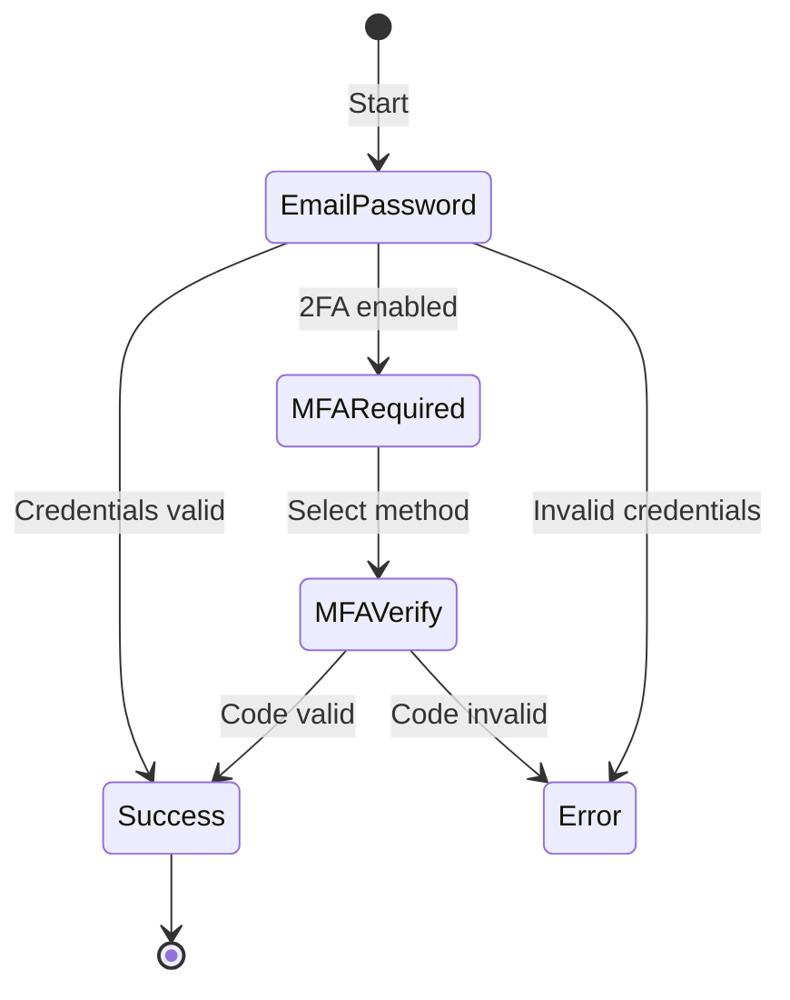

import { Callout } from 'fumadocs-ui/components/callout'
import { Tab, Tabs } from 'fumadocs-ui/components/tabs'

# Authentication Flows

The flow engine provides a declarative state machine for multi-step authentication. Instead of manually tracking "which screen should I show?", you define transitions and the engine handles navigation, back-tracking, and conditional routing (e.g., showing MFA when required).

## How Flows Work



Each flow consists of:
1. **Steps** -- named states from the `FlowStep` enum
2. **Transitions** -- rules for moving between steps
3. **Conditions** -- dynamic routing based on state (e.g., MFA required)
4. **Callbacks** -- hooks for step changes, completion, and errors

## Predefined Flows

The core package includes predefined flows for common scenarios. The `@authsome/ui-next` `NextAuthProvider` automatically selects the right flow based on the current URL path.

| Flow | Initial Step | Description |
|------|-------------|-------------|
| Sign In | `EMAIL_PASSWORD_SIGN_IN` | Email/password with MFA and email verification |
| Sign Up | `EMAIL_PASSWORD_SIGN_UP` | Registration with email verification |
| Forgot Password | `PASSWORD_RESET_REQUEST` | Request and confirm password reset |
| Verify Email | `EMAIL_VERIFICATION_REQUIRED` | Email verification flow |

## Using Flows with React

### With AuthProvider

Pass flow configuration to the provider:

```tsx
import { AuthProvider } from '@authsome/ui-react';
import { FlowStep } from '@authsome/ui-core';

function App() {
  return (
    <AuthProvider
      client={client}
      flows={{
        name: 'sign-in',
        initialStep: FlowStep.EMAIL_PASSWORD_SIGN_IN,
        allowedSteps: [
          FlowStep.EMAIL_PASSWORD_SIGN_IN,
          FlowStep.MFA_REQUIRED,
          FlowStep.MFA_VERIFY,
          FlowStep.EMAIL_VERIFICATION_REQUIRED,
          FlowStep.SUCCESS,
          FlowStep.ERROR,
        ],
        transitions: {
          [FlowStep.EMAIL_PASSWORD_SIGN_IN]: {
            onSuccess: FlowStep.SUCCESS,
            conditions: [
              {
                when: (state) => state.mfaRequired === true,
                then: FlowStep.MFA_REQUIRED,
              },
              {
                when: (state) => state.verificationRequired === true,
                then: FlowStep.EMAIL_VERIFICATION_REQUIRED,
              },
            ],
          },
          [FlowStep.MFA_VERIFY]: {
            onSuccess: FlowStep.SUCCESS,
            onBack: FlowStep.MFA_REQUIRED,
          },
        },
        onComplete: (user, session) => {
          console.log('Authenticated:', user.email);
          window.location.href = '/dashboard';
        },
      }}
      onFlowStateChange={(state) => {
        console.log('Flow step:', state.currentStep);
      }}
    >
      <MyApp />
    </AuthProvider>
  );
}
```

### Consuming Flow State

Use the `useAuth` hook to access flow state and navigation:

```tsx
import { useAuth } from '@authsome/ui-react';
import { FlowStep } from '@authsome/ui-core';

function AuthScreen() {
  const {
    currentStep,
    flowState,
    nextFlow,
    backFlow,
    cancelFlow,
    resetFlow,
    canGoBack,
    isFlowLoading,
  } = useAuth();

  switch (currentStep) {
    case FlowStep.EMAIL_PASSWORD_SIGN_IN:
      return <EmailPasswordForm onSubmit={(data) => nextFlow(data)} />;

    case FlowStep.MFA_REQUIRED:
      return (
        <MFAMethodSelect
          methods={flowState?.mfaMethods}
          onSelect={(method) => nextFlow({ mfaMethod: method })}
        />
      );

    case FlowStep.MFA_VERIFY:
      return (
        <MFAVerifyForm
          onSubmit={(code) => nextFlow({ code })}
          onBack={canGoBack ? backFlow : undefined}
        />
      );

    case FlowStep.SUCCESS:
      return <p>Authenticated successfully!</p>;

    case FlowStep.ERROR:
      return (
        <div>
          <p>Error: {flowState?.error?.message}</p>
          <button onClick={resetFlow}>Try Again</button>
        </div>
      );

    default:
      return null;
  }
}
```

## Custom Flows

### Device Flow (RFC 8628)

For CLI tools and smart TVs:

```tsx
const deviceFlow = {
  name: 'device-authorization',
  initialStep: FlowStep.DEVICE_FLOW_INITIATE,
  allowedSteps: [
    FlowStep.DEVICE_FLOW_INITIATE,
    FlowStep.DEVICE_CODE_ENTRY,
    FlowStep.DEVICE_AUTHORIZE,
    FlowStep.DEVICE_POLLING,
    FlowStep.SUCCESS,
    FlowStep.ERROR,
  ],
  transitions: {
    [FlowStep.DEVICE_FLOW_INITIATE]: {
      onSuccess: FlowStep.DEVICE_POLLING,
    },
    [FlowStep.DEVICE_CODE_ENTRY]: {
      onSuccess: FlowStep.DEVICE_AUTHORIZE,
    },
    [FlowStep.DEVICE_AUTHORIZE]: {
      onSuccess: FlowStep.SUCCESS,
    },
    [FlowStep.DEVICE_POLLING]: {
      onSuccess: FlowStep.SUCCESS,
      conditions: [
        {
          when: (state) => state.deviceAuthorized === false,
          then: FlowStep.ERROR,
        },
      ],
    },
  },
};
```

### Magic Link Flow

```tsx
const magicLinkFlow = {
  name: 'magic-link',
  initialStep: FlowStep.MAGIC_LINK_REQUEST,
  allowedSteps: [
    FlowStep.MAGIC_LINK_REQUEST,
    FlowStep.MAGIC_LINK_SENT,
    FlowStep.MAGIC_LINK_VERIFY,
    FlowStep.SUCCESS,
    FlowStep.ERROR,
  ],
  transitions: {
    [FlowStep.MAGIC_LINK_REQUEST]: {
      onSuccess: FlowStep.MAGIC_LINK_SENT,
    },
    [FlowStep.MAGIC_LINK_VERIFY]: {
      onSuccess: FlowStep.SUCCESS,
    },
  },
};
```

## Flow State

The `FlowState` object tracks all data as the user progresses:

```typescript
interface FlowState {
  currentStep: FlowStep;
  previousStep?: FlowStep;
  user?: User;
  session?: Session;
  email?: string;
  phone?: string;
  token?: string;
  mfaRequired?: boolean;
  mfaMethods?: TwoFactorMethod[];
  oauthProvider?: OAuthProvider;
  verificationRequired?: boolean;
  deviceCode?: string;
  userCode?: string;
  error?: AuthError;
  metadata?: Record<string, unknown>;
}
```

<Callout type="info">
The flow engine persists state across step transitions, so data entered in earlier steps (like email) is available in later steps without prop drilling.
</Callout>
