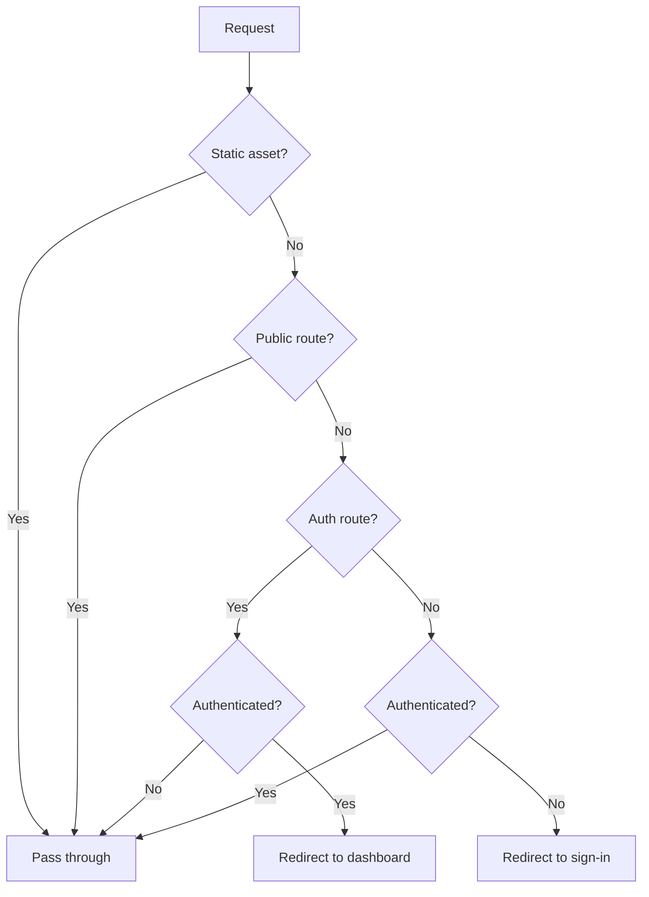

import { Callout } from 'fumadocs-ui/components/callout'
import { Tab, Tabs } from 'fumadocs-ui/components/tabs'

# Middleware Protection

AuthSome UI provides Edge Runtime-compatible middleware for Next.js. It intercepts requests before they reach your pages, redirecting unauthenticated users and preventing authenticated users from seeing auth pages.

## Basic Setup

```typescript
// middleware.ts
import { createAuthMiddleware } from '@authsome/ui-next/middleware';
import { AuthSomeAdapter } from '@authsome/adapter-authsome';

const adapter = new AuthSomeAdapter();
adapter.initialize({
  apiUrl: process.env.AUTH_URL!,
  authMode: 'cookies',
});

export default createAuthMiddleware({
  adapter,
  publicRoutes: ['/', '/about'],
  authRoutes: ['/auth/signin', '/auth/signup'],
});

export const config = {
  matcher: ['/((?!_next|favicon.ico|.*\\.).*)'],
};
```

## Configuration

```typescript
interface MiddlewareConfig {
  /** Authentication adapter (required) */
  adapter: AuthProvider;

  /** Base path for auth routes (default: '/auth') */
  basePath?: string;

  /** Routes accessible without authentication */
  publicRoutes?: string[];

  /** Auth-specific routes (redirected away when authenticated) */
  authRoutes?: string[];

  /** Where to redirect after successful auth (default: '/') */
  afterAuthRedirect?: string;

  /** Where to redirect after sign out (default: '/auth/signin') */
  afterSignOutRedirect?: string;

  /** Session configuration */
  session?: SessionConfig;

  /** Page path configuration */
  pages?: PageConfig;

  /** Custom auth requirement function */
  requiresAuth?: (pathname: string) => boolean | Promise<boolean>;
}
```

## Route Matching

The middleware supports three pattern types:

| Pattern | Example | Matches |
|---------|---------|---------|
| Exact | `/api/users` | Only `/api/users` |
| Single wildcard | `/api/*` | `/api/users`, `/api/posts` |
| Glob | `/api/**` | `/api/users/123/posts` (any depth) |

### Example

```typescript
export default createAuthMiddleware({
  adapter,
  publicRoutes: [
    '/',                    // Exact: home page
    '/about',               // Exact: about page
    '/blog/**',             // Glob: all blog pages
    '/api/public/*',        // Wildcard: public API endpoints
    '/assets/**',           // Glob: all static assets
  ],
  authRoutes: [
    '/auth/signin',
    '/auth/signup',
    '/auth/forgot-password',
    '/auth/reset-password',
    '/auth/verify-email',
    '/auth/callback/*',     // OAuth callbacks
  ],
});
```

## Middleware Behavior

1. **Skip static assets**: `_next`, `favicon.ico`, and files with extensions are skipped
2. **Public routes**: Always accessible, no auth check
3. **Auth routes**: Accessible only when NOT authenticated. Authenticated users are redirected to `afterAuthRedirect`
4. **All other routes**: Require authentication. Unauthenticated users are redirected to sign-in with a `callbackUrl` parameter



## Custom Middleware Handler

For advanced logic, use `createAuthMiddlewareWithHandler`:

```typescript
import { createAuthMiddlewareWithHandler } from '@authsome/ui-next/middleware';
import { NextResponse } from 'next/server';

export default createAuthMiddlewareWithHandler(
  {
    adapter,
    publicRoutes: ['/', '/about'],
  },
  async (request, session) => {
    const { pathname } = request.nextUrl;

    // Role-based access control
    if (pathname.startsWith('/admin')) {
      if (!session || session.user?.metadata?.role !== 'admin') {
        return NextResponse.redirect(new URL('/unauthorized', request.url));
      }
    }

    // Organization-scoped routes
    if (pathname.startsWith('/org/')) {
      const orgSlug = pathname.split('/')[2];
      const userOrgs = session?.user?.organizationMemberships || [];
      const hasAccess = userOrgs.some((m) => m.organization.slug === orgSlug);

      if (!hasAccess) {
        return NextResponse.redirect(new URL('/unauthorized', request.url));
      }
    }

    return NextResponse.next();
  }
);
```

## Edge Session Utilities

Low-level utilities for Edge Runtime:

```typescript
import {
  getSessionFromRequest,
  getSessionFromAdapter,
  createSessionCookie,
  isAuthenticated,
} from '@authsome/ui-next/middleware';

// Get session from a request
const session = await getSessionFromAdapter(adapter, request);

// Check if request is authenticated
const authed = await isAuthenticated(adapter, request);
```

## Matcher Configuration

The `config.matcher` tells Next.js which routes the middleware should run on. Common patterns:

```typescript
export const config = {
  // Match all routes except Next.js internals and static files
  matcher: ['/((?!_next|favicon.ico|.*\\.).*)'],
};
```

```typescript
export const config = {
  // Only match specific paths
  matcher: ['/dashboard/:path*', '/api/:path*', '/auth/:path*'],
};
```

<Callout type="warn">
The `matcher` in `config` uses Next.js path matching syntax, which is different from the wildcard patterns in `publicRoutes` and `authRoutes`. The `matcher` determines which routes the middleware function runs on; `publicRoutes`/`authRoutes` determine what the middleware does for each route.
</Callout>
