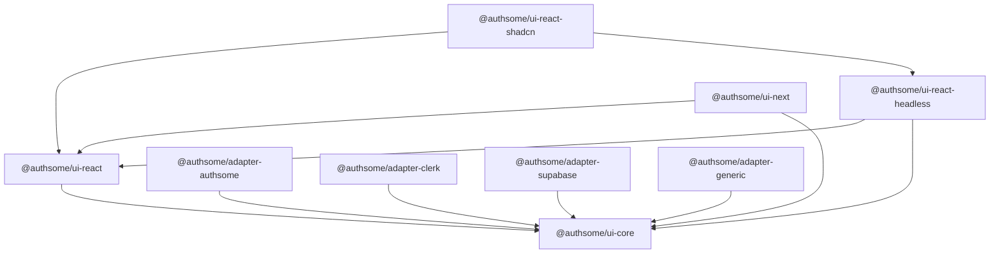

import { Card, Cards } from 'fumadocs-ui/components/card'
import { Callout } from 'fumadocs-ui/components/callout'
import { Tab, Tabs } from 'fumadocs-ui/components/tabs'

**AuthSome UI** is a comprehensive authentication UI library for React and Next.js applications. It provides a layered architecture of packages -- from a framework-agnostic core to fully styled components -- so you can pick the level of abstraction that fits your project.

<Callout type="info">
AuthSome UI works with any authentication backend through its adapter system. Use it with the AuthSome Go backend, Clerk, Supabase, or build a custom adapter for your own API.
</Callout>

## Key Features

<Cards>
  <Card
    title="Adapter-Based Architecture"
    description="Swap backends without changing UI code. Adapters for AuthSome, Clerk, Supabase, and custom APIs included."
    href="/docs/ui/adapters"
  />
  <Card
    title="13+ React Hooks"
    description="Purpose-built hooks for sign-in, sign-up, OAuth, magic links, passkeys, 2FA, organizations, and more."
    href="/docs/ui/api/hooks"
  />
  <Card
    title="Headless Components"
    description="Unstyled, accessible render-prop components. Full control over markup while AuthSome handles the logic."
    href="/docs/ui/packages/react-headless"
  />
  <Card
    title="Next.js Integration"
    description="App Router support with server components, server actions, middleware protection, and OAuth callback handling."
    href="/docs/ui/packages/next"
  />
  <Card
    title="Flow Engine"
    description="Declarative authentication flows with automatic step transitions, MFA handling, and email verification."
    href="/docs/ui/guides/authentication-flows"
  />
  <Card
    title="shadcn CLI"
    description="Copy-paste styled components into your project using a CLI, just like shadcn/ui. Own your auth UI code."
    href="/docs/ui/packages/react-shadcn"
  />
</Cards>

## Package Overview

AuthSome UI is composed of modular packages that build on each other:



| Package | Description |
|---------|-------------|
| `@authsome/ui-core` | Framework-agnostic auth client, types, flow engine, and i18n |
| `@authsome/ui-react` | React context provider, hooks, and route protection components |
| `@authsome/ui-react-headless` | Unstyled render-prop components for full UI control |
| `@authsome/ui-react-shadcn` | CLI tool to scaffold styled auth components (shadcn style) |
| `@authsome/ui-next` | Next.js App Router integration, server actions, and middleware |

### Adapters

| Adapter | Backend |
|---------|---------|
| `@authsome/adapter-authsome` | AuthSome Go backend (official) |
| `@authsome/adapter-clerk` | Clerk authentication service |
| `@authsome/adapter-supabase` | Supabase Auth |
| `@authsome/adapter-generic` | Any REST API with configurable endpoints |

## Quick Example

<Tabs items={['React', 'Next.js']}>
  <Tab value="React">
    ```tsx
    import { AuthClient } from '@authsome/ui-core';
    import { AuthProvider, useSignIn, useUser } from '@authsome/ui-react';
    import { AuthSomeAdapter } from '@authsome/adapter-authsome';

    // 1. Create adapter and client
    const adapter = new AuthSomeAdapter();
    adapter.initialize({
      apiUrl: 'https://auth.yourapp.com',
      plugins: ['social', 'twofa'],
    });

    const client = new AuthClient({ provider: adapter });

    // 2. Wrap your app
    function App() {
      return (
        <AuthProvider client={client}>
          <MyApp />
        </AuthProvider>
      );
    }

    // 3. Use hooks anywhere
    function LoginButton() {
      const { signIn, isLoading, error } = useSignIn();
      const user = useUser();

      if (user) return <p>Welcome, {user.name}!</p>;

      return (
        <button
          onClick={() => signIn({ email: 'user@example.com', password: 'secret' })}
          disabled={isLoading}
        >
          {isLoading ? 'Signing in...' : 'Sign In'}
        </button>
      );
    }
    ```
  </Tab>
  <Tab value="Next.js">
    ```tsx
    // app/providers.tsx
    'use client';
    import { NextAuthProvider } from '@authsome/ui-next';
    import { AuthSomeAdapter } from '@authsome/adapter-authsome';

    const adapter = new AuthSomeAdapter();
    adapter.initialize({
      apiUrl: process.env.NEXT_PUBLIC_AUTH_URL!,
      authMode: 'cookies',
      plugins: ['social'],
    });

    export function Providers({ children }: { children: React.ReactNode }) {
      return (
        <NextAuthProvider config={{ adapter }}>
          {children}
        </NextAuthProvider>
      );
    }
    ```

    ```typescript
    // middleware.ts
    import { createAuthMiddleware } from '@authsome/ui-next/middleware';
    import { AuthSomeAdapter } from '@authsome/adapter-authsome';

    const adapter = new AuthSomeAdapter();
    adapter.initialize({
      apiUrl: process.env.AUTH_URL!,
      authMode: 'cookies',
    });

    export default createAuthMiddleware({
      adapter,
      publicRoutes: ['/', '/about', '/pricing'],
      authRoutes: ['/auth/signin', '/auth/signup'],
    });

    export const config = {
      matcher: ['/((?!_next|favicon.ico).*)'],
    };
    ```
  </Tab>
</Tabs>

## What's Next?

<Cards>
  <Card
    title="Installation"
    description="Install the packages you need for your project"
    href="/docs/ui/installation"
  />
  <Card
    title="Quick Start"
    description="Build your first authenticated app in 5 minutes"
    href="/docs/ui/quick-start"
  />
  <Card
    title="Adapters"
    description="Choose and configure the right adapter for your backend"
    href="/docs/ui/adapters"
  />
  <Card
    title="API Reference"
    description="Complete reference for all hooks, components, and types"
    href="/docs/ui/api/hooks"
  />
</Cards>

## Community & Support

- **GitHub**: [github.com/xraph/authsome-ui](https://github.com/xraph/authsome-ui)
- **Issues**: Report bugs and request features
- **Discussions**: Ask questions and share ideas

<Callout type="warn">
AuthSome UI is in active development. APIs may change before the stable 1.0 release. Check the changelog for breaking changes.
</Callout>
